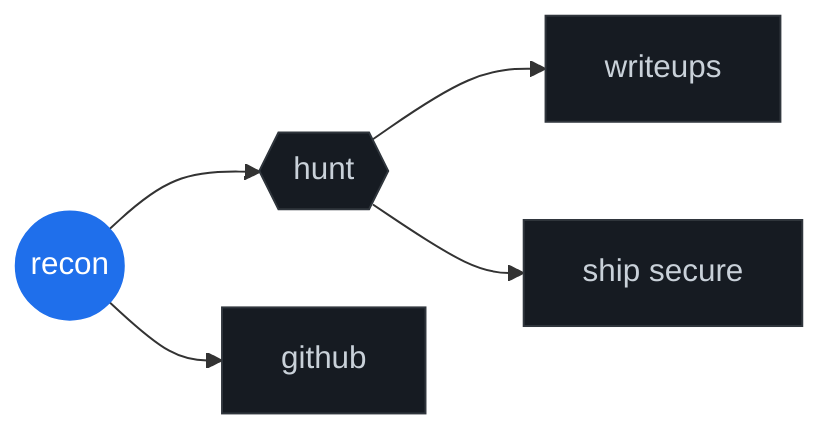

# test.md — validate which trick survives GitHub rendering

> Open the **rendered** version of this file on github.com (not the raw view). Each section is independent — pick the one(s) you like and tell me which to fold into the real README.

---

## 1. Clickable Mermaid attack-graph nav

Most people don't know Mermaid nodes can be real links inside a GitHub README.

**Validate:** click each leaf node — `writeups`, `ship secure`, `github` should navigate.

---

## 2. Self-typing SVG terminal

SMIL animation inside an SVG, rendered as a plain markdown image. No JS, GitHub-safe.

**Validate:** you should see the `$ ./hunt --target acme.com` line type itself, then the `[CRIT]` line type itself, then loop. Cursor blinks.

---

## 3. Stealth fingerprint that reads like body text

Looks like a plain italic sentence. Actually live-detects your browser / OS / screen via CSS `@supports` and `@media` queries — zero JS. Theme-adapts internally.

**Validate:** the line should read e.g. `reading from chrome · macos / ios · desktop.` and match the surrounding text color in both light and dark mode. Open in another browser to confirm it changes.

---

## 4. GitHub alert as a security PSA

Native GFM callout. Phrasing as a fake advisory.

> [!CAUTION]
> Reading the source of this README discloses one (1) hidden flag.
> **CVSS:** 0.0 (Informational) — won't fix.

**Validate:** the block should render with a red border and a warning icon. The text inside should be normal.

---

<i>none of these require GitHub Actions, JS, or external services. all four work from a static repo.</i>
